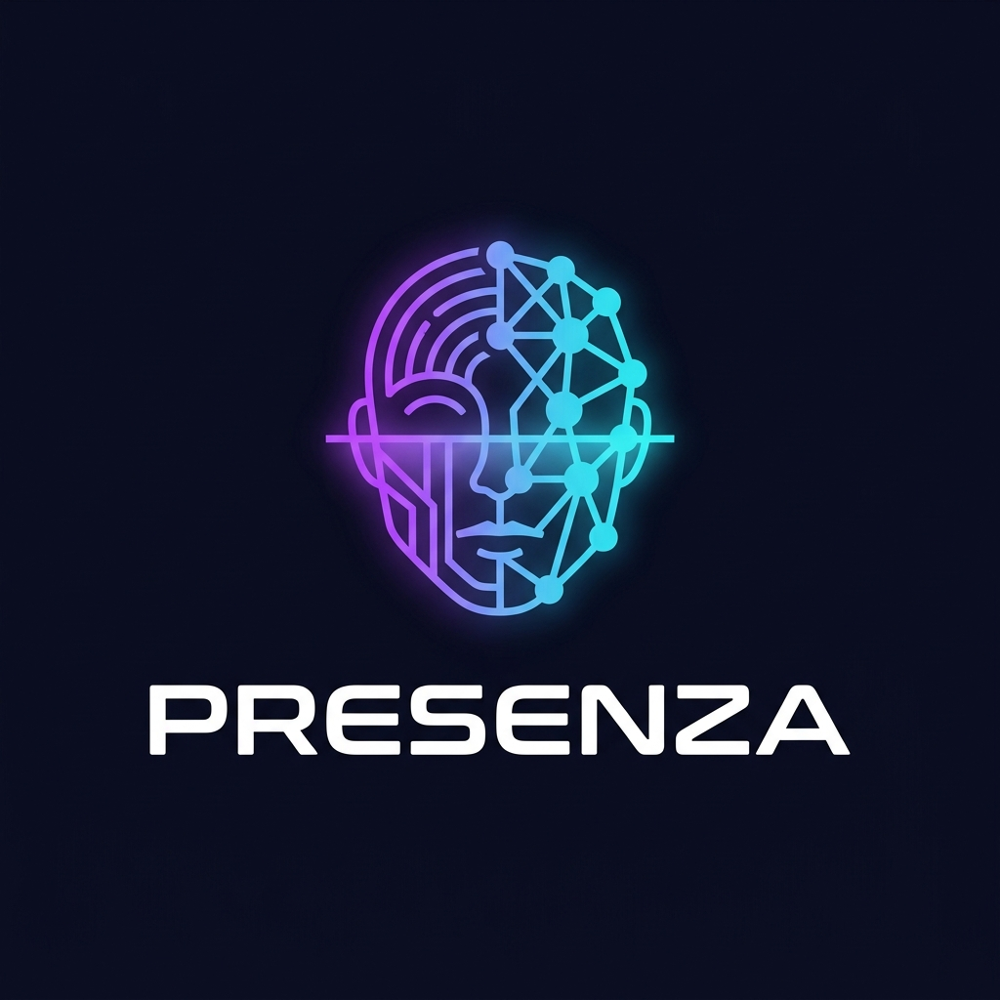
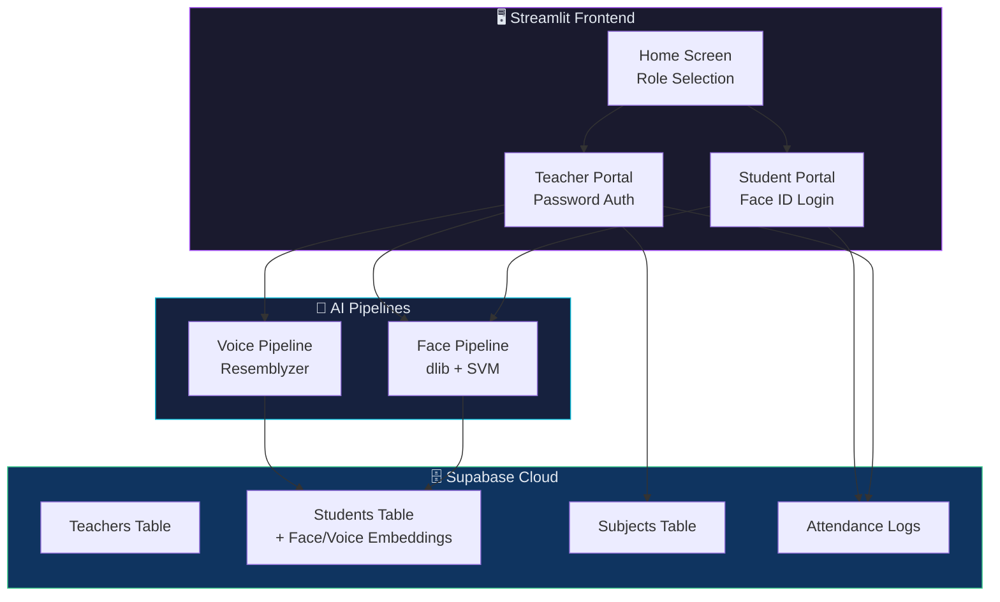
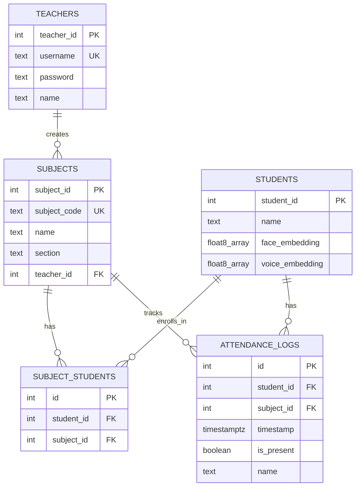

<div align="center">



# PRESENZA

### 🧠 AI-Powered Face & Voice Attendance System

[](https://streamlit.io)
[](https://python.org)
[](https://supabase.com)
[](LICENSE)
[](https://presenza-main.streamlit.app)

**PRESENZA** *(Italian for "Presence")* is a next-generation classroom attendance system that replaces manual roll calls with **AI-powered face recognition** and **voice identification** — making attendance instant, contactless, and fraud-proof.

[🚀 Live Demo](https://presenza-main.streamlit.app) · [📖 Documentation](#-architecture) · [🐛 Report Bug](https://github.com/ChiragSimepurushkar/presenza-main/issues)

---

</div>

## ✨ Features

<table>
<tr>
<td width="50%">

### 🎯 For Teachers
- 📸 **AI Face Attendance** — Upload classroom photos, AI identifies every student
- 🎙️ **Voice Attendance** — Record classroom audio, AI matches student voices
- 📚 **Subject Management** — Create subjects, track enrollment & class sessions
- 📊 **Attendance Records** — View detailed logs with present/absent stats
- 🔗 **QR Code Sharing** — Generate QR codes & links for students to join classes

</td>
<td width="50%">

### 🧑‍🎓 For Students
- 🔐 **Face ID Login** — No passwords needed, login with your face
- 🗣️ **Voice Enrollment** — Optional voice profile for voice-based attendance
- 📋 **Subject Enrollment** — Join classes via code, QR scan, or shared link
- 📈 **Attendance Tracking** — View personal attendance stats per subject
- ⚡ **Auto-Join Links** — Click a link to instantly enroll in a class

</td>
</tr>
</table>

---

## 🛠️ Tech Stack

<div align="center">

| Layer | Technology | Purpose |
|:---:|:---:|:---|
| 🖥️ **Frontend** | Streamlit | Interactive web UI with real-time updates |
| 🧠 **Face AI** | dlib + SVM | Face detection, 128D embeddings, SVM classification |
| 🗣️ **Voice AI** | Resemblyzer + Librosa | Voice embeddings (256D), speaker identification |
| 🗄️ **Database** | Supabase (PostgreSQL) | Cloud-hosted database for all data |
| 🔒 **Auth** | bcrypt | Secure password hashing for teachers |
| 📱 **QR Codes** | Segno | Class join link QR code generation |

</div>

---

## 🏗️ Architecture



---

## 📁 Project Structure

```
PRESENZA/
├── app.py                          # 🚀 Main entry point
├── requirements.txt                # 📦 Dependencies
├── assets/
│   └── logo.jpg                    # 🎨 Project logo
├── src/
│   ├── screens/
│   │   ├── home_screen.py          # 🏠 Landing page (role selection)
│   │   ├── student_screen.py       # 🧑‍🎓 Student login + dashboard
│   │   └── teacher_screen.py       # 👨‍🏫 Teacher login + dashboard
│   ├── components/
│   │   ├── header.py               # 🔝 App header with logo
│   │   ├── footer.py               # 🔻 App footer with credits
│   │   ├── subject_card.py         # 🃏 Reusable subject card
│   │   ├── dialog_enroll.py        # 📝 Student enrollment dialog
│   │   ├── dialog_auto_enroll.py   # ⚡ Quick-join via QR/link
│   │   ├── dialog_create_subject.py# ➕ Create new subject
│   │   ├── dialog_share_subject.py # 🔗 Share QR code + link
│   │   ├── dialog_add_photo.py     # 📸 Camera/upload photos
│   │   ├── dialog_attendance_results.py # ✅ Review & confirm results
│   │   └── dialog_voice_attendance.py   # 🎙️ Voice attendance flow
│   ├── pipelines/
│   │   ├── face_pipeline.py        # 🧠 Face detection + SVM model
│   │   └── voice_pipeline.py       # 🗣️ Voice embedding + matching
│   ├── database/
│   │   ├── config.py               # 🔑 Supabase client setup
│   │   └── db.py                   # 💾 All database operations
│   └── ui/
│       └── base_layout.py          # 🎨 Global theme & styling
└── .streamlit/
    └── secrets.toml                # 🔐 API keys (not committed)
```

---

## ⚡ Quick Start

### Prerequisites

- **Python 3.10+**
- **Supabase account** ([supabase.com](https://supabase.com))
- **CMake** installed (required for dlib)

### 1. Clone the Repository

```bash
git clone https://github.com/ChiragSimepurushkar/presenza-main.git
cd presenza-main
```

### 2. Create Virtual Environment

```bash
python -m venv venv

# Windows
venv\Scripts\activate

# macOS/Linux
source venv/bin/activate
```

### 3. Install Dependencies

```bash
pip install -r requirements.txt
```

### 4. Configure Supabase

Create `.streamlit/secrets.toml`:

```toml
SUPABASE_URL = "https://your-project.supabase.co"
SUPABASE_KEY = "your-anon-key"
```

### 5. Set Up Database Tables

Create these tables in your Supabase dashboard:

```sql
-- Teachers table
CREATE TABLE teachers (
    teacher_id SERIAL PRIMARY KEY,
    username TEXT UNIQUE NOT NULL,
    password TEXT NOT NULL,
    name TEXT NOT NULL
);

-- Students table
CREATE TABLE students (
    student_id SERIAL PRIMARY KEY,
    name TEXT NOT NULL,
    face_embedding FLOAT8[],
    voice_embedding FLOAT8[]
);

-- Subjects table
CREATE TABLE subjects (
    subject_id SERIAL PRIMARY KEY,
    subject_code TEXT UNIQUE NOT NULL,
    name TEXT NOT NULL,
    section TEXT NOT NULL,
    teacher_id INTEGER REFERENCES teachers(teacher_id)
);

-- Student-Subject enrollment
CREATE TABLE subject_students (
    id SERIAL PRIMARY KEY,
    student_id INTEGER REFERENCES students(student_id),
    subject_id INTEGER REFERENCES subjects(subject_id)
);

-- Attendance logs
CREATE TABLE attendance_logs (
    id SERIAL PRIMARY KEY,
    student_id INTEGER REFERENCES students(student_id),
    subject_id INTEGER REFERENCES subjects(subject_id),
    timestamp TIMESTAMPTZ DEFAULT NOW(),
    is_present BOOLEAN DEFAULT FALSE,
    name TEXT
);
```

### 6. Run the App

```bash
streamlit run app.py
```

🎉 Open `http://localhost:8501` in your browser!

---

## 🚀 Deploy to Streamlit Cloud

1. Push your code to GitHub
2. Go to [share.streamlit.io](https://share.streamlit.io)
3. Connect your GitHub repository
4. Set **Main file path** to `app.py`
5. Add your secrets in **Advanced Settings** → **Secrets**:
   ```toml
   SUPABASE_URL = "https://your-project.supabase.co"
   SUPABASE_KEY = "your-anon-key"
   ```
6. Click **Deploy!** 🎉

---

## 🧠 How the AI Works

### Face Recognition Pipeline

```
📸 Classroom Photo
    ↓
🔍 dlib Face Detector (HOG-based)
    ↓
📐 68-point Facial Landmark Detection
    ↓
🧮 128-Dimensional Face Embedding (dlib ResNet)
    ↓
🤖 SVM Classifier (trained on enrolled students)
    ↓
📊 Distance Threshold Check (< 0.6 = match)
    ↓
✅ Student Identified!
```

### Voice Recognition Pipeline

```
🎙️ Classroom Audio Recording
    ↓
✂️ Librosa Voice Activity Detection (split by silence)
    ↓
🔊 Audio Preprocessing & Normalization
    ↓
🧮 256-Dimensional Voice Embedding (Resemblyzer)
    ↓
📊 Cosine Similarity Matching (> 0.65 = match)
    ↓
✅ Speaker Identified!
```

---

## 🗄️ Database Schema



---

## 🤝 Contributing

Contributions are welcome! Here's how:

1. Fork the repository
2. Create your feature branch (`git checkout -b feature/amazing-feature`)
3. Commit your changes (`git commit -m 'Add amazing feature'`)
4. Push to the branch (`git push origin feature/amazing-feature`)
5. Open a Pull Request

---

## 📄 License

This project is licensed under the MIT License — see the [LICENSE](LICENSE) file for details.

---

## 👨‍💻 Author

<div align="center">

**Chirag Nikant Simepurushkar**

[](https://github.com/ChiragSimepurushkar)

---

<sub>Built with ❤️ and a lot of ☕ | PRESENZA © 2026</sub>

</div>
